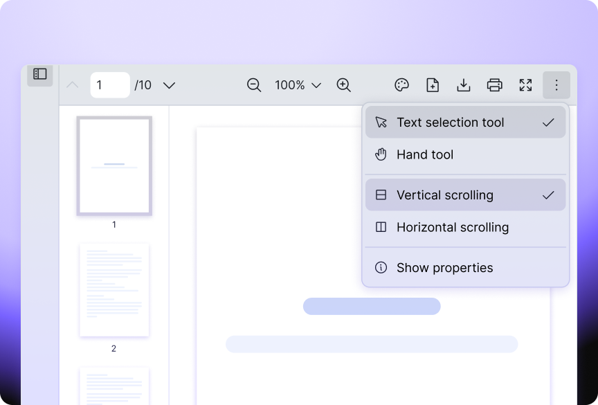
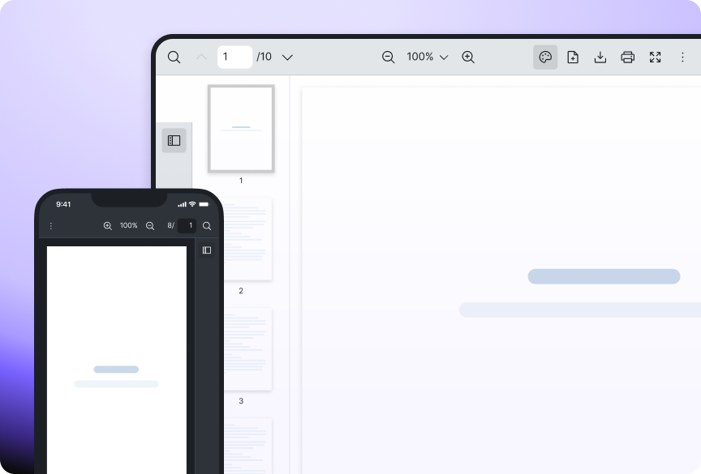
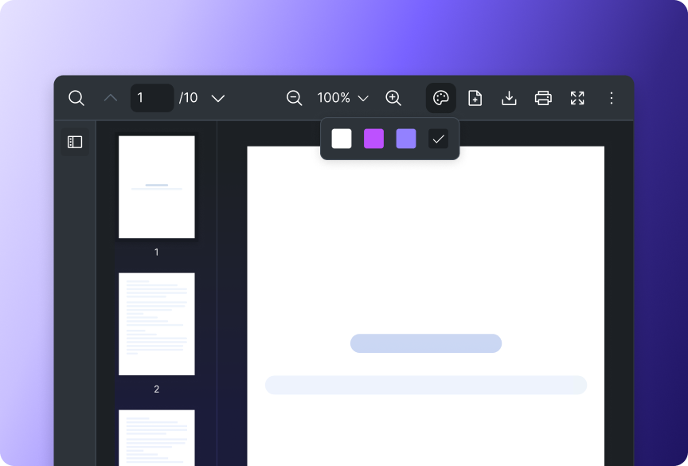
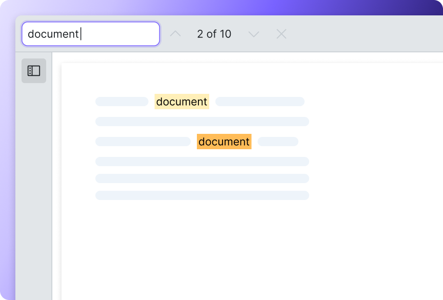

  <a href="https://www.vue-pdf-viewer.dev/" target="_blank">
    <picture>
      <source media="(prefers-color-scheme: dark)" srcset="./assets/img/vue-pdf-viewer_logo_light.jpg" width="500">
      
    </picture>
  </a>

<h1 align="center">PDF Viewer for Vue 3</h1>

  Works seamlessly on your Vue or Nuxt websites. Customizable themes, built-in localizations and accessibility support.

  
 

  
  [Vue PDF Viewer Home][vuepdfviewer] - [License](#page_facing_up-license) - [Documentation][vuepdfviewer-docs]
  
  Available for: Vue.js (3.0^), Nuxt (3.0^)

[][twitter]

# :book: Table of Contents

1. [Why Vue PDF Viewer](#star-why-vue-pdf-viewer)
2. [Features](#sparkles-features)
3. [Documentation](#bookmark_tabs-documentation)
4. [Starter Toolkit](#pushpin-starter-toolkit)
5. [Need Help?](#raising_hand-need-help)
6. [License](#page_facing_up-license)
7. [Acknowledgement](#acknowledgement)

# :star: Why Vue PDF Viewer

As developers ourselves, we faced many issues such as browser incompatibility and customizability while working with PDF libraries. Vue PDF Viewer (VPV) is created to solve these issues, and be flexible and simple to use for Vue.js developers. More importantly, we also built our technical documentation to be detailed and easy to follow along.

# :sparkles: Features

<table>
  <tr>
    <td>
1. Interactive & immersive experience
</td>
    <td>
2. Responsive display for different devices
</td>
  </tr>
  <tr>
    <td>
3. Customizable to your website's style
</td>
    <td>
4. Navigate across document easily
</td>
  </tr>
</table>

Check out the full list of Vue PDF Viewer features [over here](https://www.vue-pdf-viewer.dev/features)

# :bookmark_tabs: Documentation

To explore VPV's technical information such as basic usage or component API, please feel free to explore [Docs][vuepdfviewer-docs].

## :pushpin: Starter Toolkit

Here are some sample projects to get started on Vue PDF Viewer quickly:

1. [Vue – Composition API - TypeScript](https://github.com/vue-pdf-viewer/starter-vpv-composition-ts) 
2. [Vue – Options API - TypeScript](https://github.com/vue-pdf-viewer/starter-vpv-options-ts)
3. [Vue – Composition API - JavaScript](https://github.com/vue-pdf-viewer/starter-vpv-composition-js)
4. [Vue – Options API - JavaScript](https://github.com/vue-pdf-viewer/starter-vpv-options-js)
5. [Nuxt - TypeScript](https://github.com/vue-pdf-viewer/starter-vpv-nuxt-ts)

# :raising_hand: Need Help?

We are more than happy to help you. If you have any questions, run into any errors or face any problems, please feel free to create an issue in [Issues](../../issues) or PM us directly in [Twitter][twitter]. Anything related to VPV is on the table!

# :page_facing_up: License

Vue PDF Viewer is distributed under our proprietary license. Please refer to our [License page](https://www.vue-pdf-viewer/license-agreement) file for more details.

If you would like to use Vue PDF Viewer commercially, please purchase a license from [our website][vuepdfviewer] or reach out to us directly at [david@vue-pdf-viewer.dev](mailto:david@vue-pdf-viewer.dev).

# Acknowledgement

- [pdf.js](https://github.com/mozilla/pdf.js)
- [Img Shields](https://shields.io)
- [Vue.js](https://vuejs.org/)

[twitter]: https://x.com/VuePDF
[vuepdfviewer]: https://www.vue-pdf-viewer.dev
[vuepdfviewer-docs]: https://docs.vue-pdf-viewer.dev
