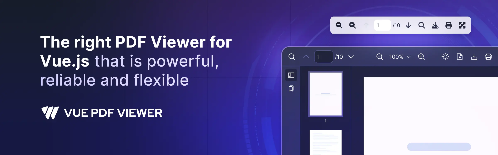

<div align="center">
  <a href="https://www.vue-pdf-viewer.dev/?utm_source=github" target="_blank">
    <picture>
      <source srcset="./assets/img/vue-pdf-viewer_cover.webp">
      
    </picture>
  </a>
</div>

<br/>
<div align="center">
  Works seamlessly on your Vue 3 or Nuxt websites. Fast, Customizable and Web Responsive PDF viewer. Save you weeks of development time.
</div>  
<br/>

<div align="center">
  
  [Vue PDF Viewer Home][vuepdfviewer] - [License](#page_facing_up-license) - [Documentation][vuepdfviewer-docs]

[][npm]
[][twitter]

</div>

# :star: Why Vue PDF Viewer

- **Save Weeks of Development Time**: Vue PDF Viewer simplifies PDF integration with ready-to-use tools, minimizing the need for custom development and saving you valuable time.
- **Tailored for Vue.js & Nuxt.js**: Vue PDF Viewer is native to Vue.js, ensuring smooth integration into your projects.
- **Customizability at Its Core**: Built with flexibility in mind, allowing you to match your application’s unique style and functionality.
- **High-Performance & Rapid Rendering**: Optimized for rendering large PDFs efficiently, Vue PDF Viewer delivers lightning-fast load times with features like virtual scrolling.
- **Annotation Support**: With the annotation plugin, users can highlight, add free text, insert images and export annotated PDFs for collaboration and review.
- **Accessibility & Localization**: Designed with inclusivity in mind, Vue PDF Viewer supports ARIA attributes and localized tooltips, catering to diverse user bases.
- **Modern Browser Compatibility**: Works seamlessly across modern browsers, eliminating compatibility headaches.
- **Active Development & Support**: With regular updates and a responsive support team, Vue PDF Viewer evolves to meet developer needs.

<p align="center">
  
</p>

# 📜 Background

As developers ourselves, we faced many issues such as browser incompatibility and customizability while trying to render a PDF document or working with PDF libraries. Having faced issues using PDF libraries, we want the solution to be flexible for Vue.js developers and teams. More importantly, the technical document must be easy to use!

# :sparkles: Features

- 🎯 **Interactive & Immersive Viewing Experience** with features like rotation, zoom, and keyboard navigation.
- 📱 **Responsive Across All Devices** for a consistent experience on desktops, tablets and mobile devices.
- 🎨 **Customizable UI and Styling** to tailor the viewer’s appearance to match your website’s theme.
- 🧭 **Advanced Navigation Options** to browse documents easily with table of contents, hyperlinks, and a powerful search tool.
- ⚡ **High-Performance Rendering** to load large PDF documents quickly and handle complex elements like vector graphics with ease.
- 🔧 **Programmatic Control with Instance APIs**, allowing you to interact with the viewer programmatically.
- 🖋️ **Form Support for XFA and AcroForms** to seamlessly display interactive PDF forms.
- 🖊️ **Annotation Tools** for text highlighting, free text annotations, image overlay and customizable styles, with options to save updates into new PDFs.
- 🌍 **Localization Support** to translate tooltips and text into your preferred language for an inclusive experience.
- 📂 **Document Management Tools**, including features like downloading and printing.
- 👁️ **Accessibility Support** to built-in support for ARIA attributes and localized tooltips, catering to diverse user bases.

For the full feature set, visit [Vue PDF Viewer Features](https://www.vue-pdf-viewer.dev/features?utm_source=github).

# :zap: Quick Start Guide

Here’s how to get started with Vue PDF Viewer in your Vue 3 or Nuxt 3 project:

## 1. Check Prerequsities

Here are the basic system requirements to run the Vue PDF Viewer component:

- Vue version: >= 3.0
- Nuxt version: >= 3.0

_Remark:_

- _Vite version will affect the Vue or Nuxt version used._
- _If using TypeScript, it requires >= TypeScript 4.6._

### Browser support

| Chrome | Firefox | Edge | Safari | Safari iOS | Chrome Android |
| ------ | ------- | ---- | ------ | ---------- | -------------- |
| 115+   | 115+    | 115+ | 16.5+  | 16.5+      | 126+           |

## 2. Install the Package

Use your preferred package manager to install the Vue PDF Viewer package:

### Using bun:

```bash
bun add @vue-pdf-viewer/viewer
```

### Using npm:

```bash
npm install @vue-pdf-viewer/viewer
```

### Using yarn:

```bash
yarn add @vue-pdf-viewer/viewer
```

### Using pnpm:

```bash
pnpm install @vue-pdf-viewer/viewer
```

Vue PDF Viewer uses APIs from pdf.js and pnpm command will attempt to update the version of pdfjs-dist that may be higher than the default version in the Vue PDF Viewer library. You might encounter an error, such as:

```bash
UnknownErrorException: The API version "4.4.168" does not match the Worker version "4.0.269".
```

To avoid version mismatch, please add pnpm.overrides to your package.json to specify the exact version of pdfjs-dist:

```json
"pnpm": {
  "overrides": {
    "pdfjs-dist": "4.4.168"
  }
}
```

After that, you can install Vue PDF Viewer via pnpm command

```bash
pnpm add @vue-pdf-viewer/viewer
```

For more information on how to use different package managers, please visit our [installation guide](https://docs.vue-pdf-viewer.dev/introduction/getting-started.html#installation?utm_source=github).

## 3. Import and Use the Component

To initiate Vue PDF Viewer, you will first need to import VPdfViewer component.

There are two main ways to use Vue PDF Viewer in your project, namely:

- **Composition API**: A new method to organize and reuse logic by allowing developers to write components as functions.
- **Options API**: A traditional method from Vue 2 where components are grouped into series of options.

### Composition API:

```vue
<script setup>
import { VPdfViewer } from "@vue-pdf-viewer/viewer";
</script>
<template>
  <div :style="{ width: '1028px', height: '700px' }">
    <VPdfViewer
      src="https://raw.githubusercontent.com/mozilla/pdf.js/ba2edeae/web/compressed.tracemonkey-pldi-09.pdf"
    />
  </div>
</template>
```

### Options API:

```vue
<script>
import { VPdfViewer } from "@vue-pdf-viewer/viewer";

export default {
  components: { VPdfViewer },
  data() {
    return {
      src: "https://raw.githubusercontent.com/mozilla/pdf.js/ba2edeae/web/compressed.tracemonkey-pldi-09.pdf",
    };
  },
};
</script>
<template>
  <VPdfViewer :src="src" />
</template>
```

You may also check out our [Starter Toolkit](#pushpin-starter-toolkit) for examples to get you started.

### 4. Customize with Props and APIs

Enhance functionality with built-in properties and instance APIs to match your app’s needs.

For detailed usage, refer to our [Documentation][vuepdfviewer-docs].

### 5. Annotation Plugin

Vue PDF Viewer supports annotations via a separate plugin that enables users to create and manage annotations directly within the viewer. Features include text highlighting, free text annotations, and customizable options such as color, font, and opacity. Annotations can be saved by printing the PDF or exporting it with the updates applied.

See our [Annotation Plugin](https://docs.vue-pdf-viewer.dev/annotation-plugin/overview.html?utm_source=github) documentation for setup and usage.

# :pushpin: Starter Toolkit

Here are some sample projects to get started on Vue PDF Viewer quickly:

1. [Vue – Composition API - TypeScript](https://github.com/vue-pdf-viewer/starter-vpv-composition-ts)
2. [Vue – Options API - TypeScript](https://github.com/vue-pdf-viewer/starter-vpv-options-ts)
3. [Vue – Composition API - JavaScript](https://github.com/vue-pdf-viewer/starter-vpv-composition-js)
4. [Vue – Options API - JavaScript](https://github.com/vue-pdf-viewer/starter-vpv-options-js)
5. [Vue – SSR - TypeScript](https://github.com/vue-pdf-viewer/starter-vpv-ssr-vue-ts)
6. [Nuxt - TypeScript](https://github.com/vue-pdf-viewer/starter-vpv-nuxt-ts)
7. [VitePress](https://github.com/vue-pdf-viewer/starter-vpv-vitepress)
8. [Quasar](https://github.com/vue-pdf-viewer/starter-vpv-quasar)

# 📝 Changelog

Check out our latest release [v3.10.0 (7 March 2026)](https://docs.vue-pdf-viewer.dev/introduction/changelog.html#viewer-v3-10-0-7-march-2026?utm_source=github&utm_medium=referral)

# :raising_hand: Need Help?

We are more than happy to help you. If you have any questions, run into any errors or face any problems, please feel free to create an issue in [Issues](../../issues) or PM us directly in [Twitter][twitter]. Anything related to VPV is on the table!

# :page_facing_up: License

Vue PDF Viewer is distributed under our proprietary license. Please refer to our [License page](https://www.vue-pdf-viewer.dev/license-agreement?utm_source=github) file for more details.

If you would like to use Vue PDF Viewer commercially, please purchase a license from [our website][vuepdfviewer] or reach out to us directly at [https://www.vue-pdf-viewer.dev/contact-us](https://www.vue-pdf-viewer.dev/contact-us).

# Acknowledgement

- [pdf.js](https://github.com/mozilla/pdf.js)
- [node-forge](https://github.com/digitalbazaar/forge)
- [Img Shields](https://shields.io)
- [Vue.js](https://vuejs.org/)

For detailed third-party license information, see [THIRD_PARTY_LICENSES.md](./THIRD_PARTY_LICENSES.md).

[twitter]: https://x.com/VuePDF
[vuepdfviewer]: https://www.vue-pdf-viewer.dev/?utm_source=github
[vuepdfviewer-docs]: https://docs.vue-pdf-viewer.dev/?utm_source=github
[npm]: https://www.npmjs.com/package/@vue-pdf-viewer/viewer
